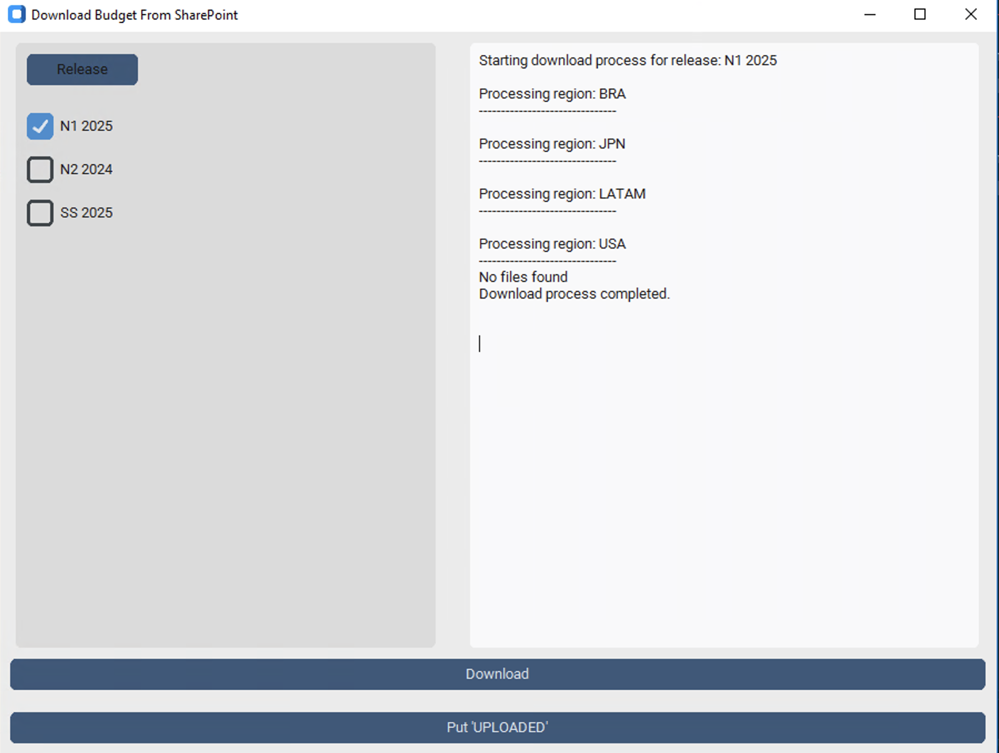

# Download Budget from Sharepoint

This project provides a graphical user interface (GUI) for managing the process of downloading, converting, and tagging budget files stored on a SharePoint server. Built using customtkinter, it streamlines workflows for handling budget-related tasks efficiently. In a nutshell, it permits to:

1. Download files from SharePoint
2. Put a tag on the very same file in the SharePoint to prevent future downloads.


## Features

- **Release Selection**: Select specific releases from a list of available options.
- **File Download**: Download budget files from a SharePoint directory and convert them into the required format.
- **File Tagging**: Tag processed files with a custom label (e.g., “UPLOADED”).
- **Logging**: View real-time logs of the processes for better traceability.


## Usage

1. Execute the main script to start the GUI: `script/main.py`
2. Choose the release you want to process from the list of checkboxes
3. Click **Download** to fetch and convert files
4. (Outside this GUI) Upload the downloaded files into SAP.
5. Click **Put 'UPLOADED'** to tag the original file in the sharepoint to prevent future downloads.

## Configuration
The `script/config.yaml` file contains key settings for the application. Here an example
```yaml
pattern file: '^(?!.*UPLOADED)((?=.*SKU)|(?=.*YELLOW))(.*XLSX)'
pattern release: '^[A-Za-z0-9]{2} \d{4}$'
regions: ('BRA', 'FIL','JPN','LATAM','USA')
budget_folder: 'BUDGET DEFINITION'
```

- `pattern file`: regex  pattern used to identify the files to process
- `pattern release`: regex pattern used to keep only the correct release format
- `regions`: list of regions/areas/type launches from where and to where process the files
- `budget_folder`: name for the SharePoint folder where the files are stored

## Project Structure

```yaml
download_bgt/
│
├── script/
│   ├── core/
│   │   ├── config_loader.py       # Handles configuration loading.
│   │   ├── sharepoint.py          # Resolves SharePoint paths.
│   │
│   ├── gui/
│   │   ├── components.py          # Contains reusable GUI components like checkboxes.
|   |   ├── app.py                 # Main GUI.
│   │
│   ├── utils/
│   │   ├── tools.py               # Utility functions for file processing.
│   │   ├── constants.py           # OS and user-related constants.
│   │
│   ├── __pycache__/               # Compiled Python files.
│   │
│   ├── main.py                    # Entry point for the application.
│
├── config.yaml                    # Configuration file for patterns and paths.
├── README.md                      # Project documentation (this file).
```


## License

This project is licensed under the MIT License.
